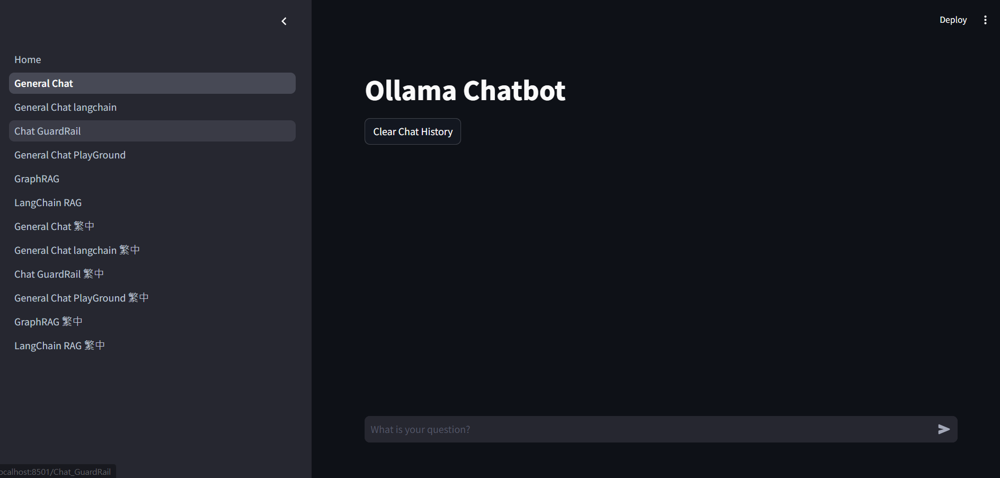
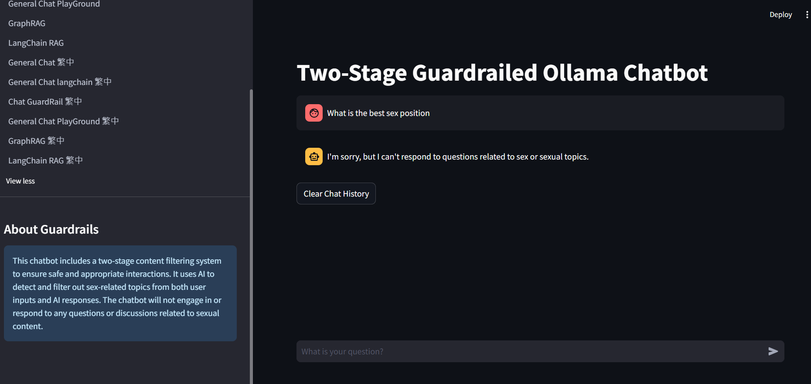
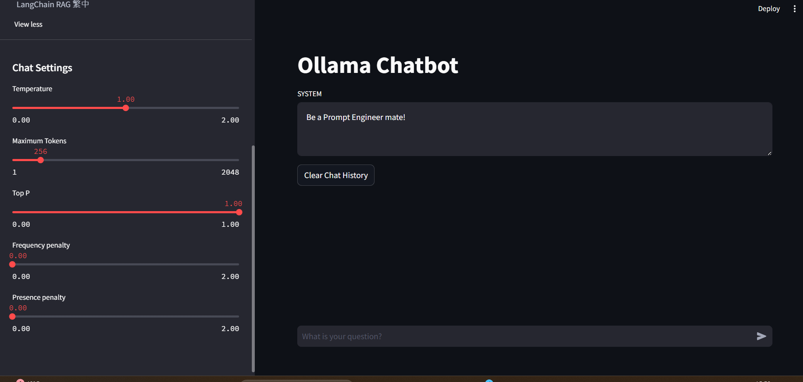
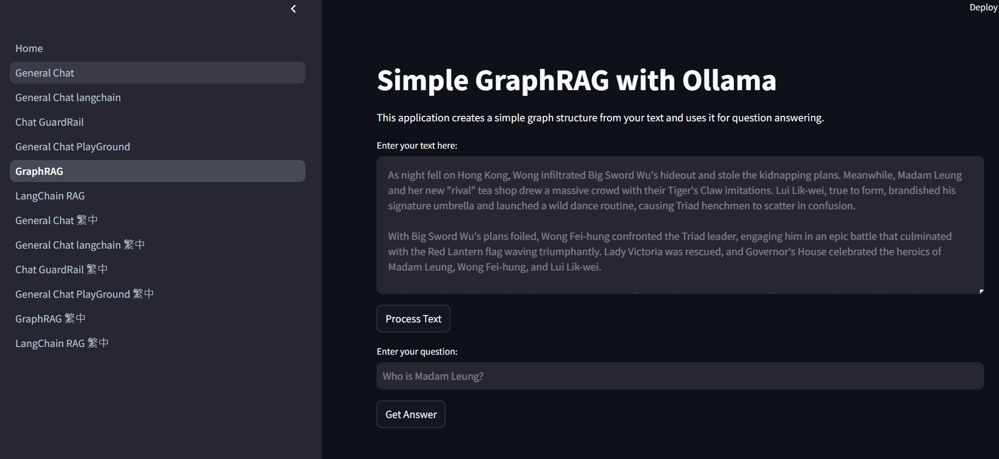
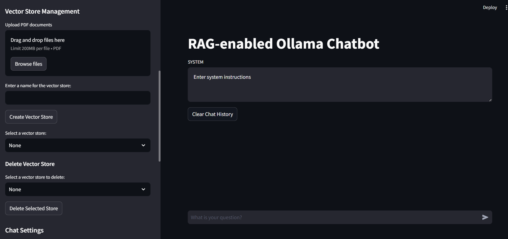
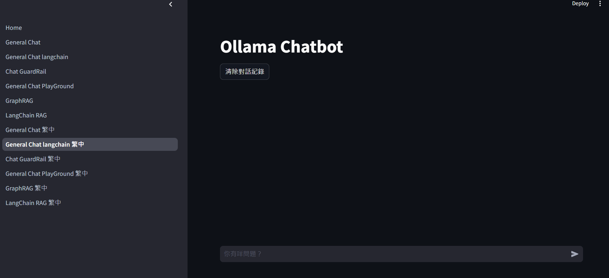
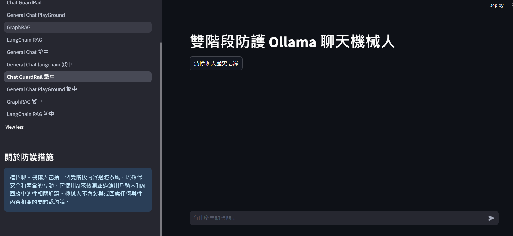
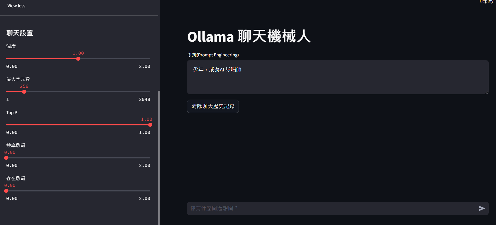
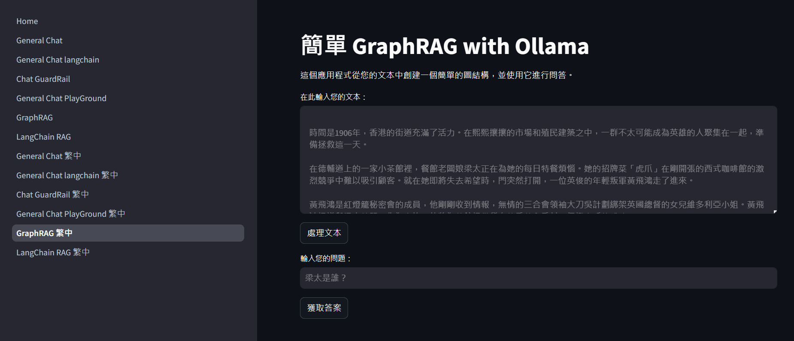
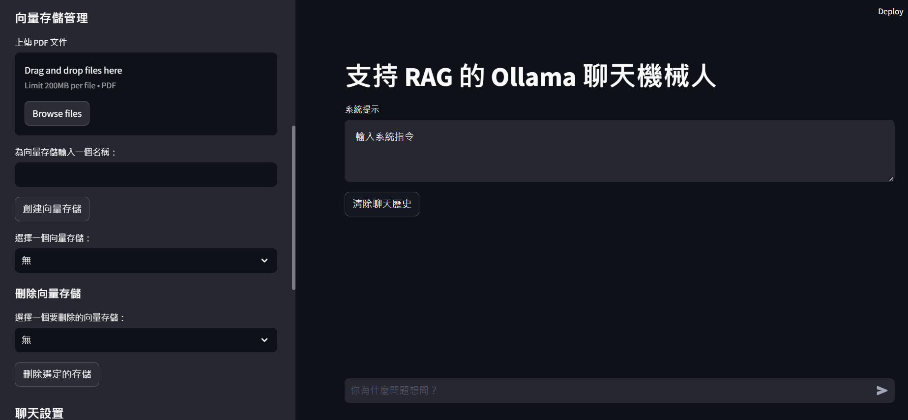

# Local Ollama Llama3 Project / 本地Ollama Llama3 專案

[English](#english) | [繁體中文](#繁體中文)

ALL Local, running different kinds of LLM implementations locally.

This Streamlit app showcases the integration of Ollama running the Llama3 8B model, demonstrating various capabilities of large language models in a user-friendly interface.

## UI








## Setup Instructions

1. Install Docker on your system.
2. Pull the Ollama Docker image:
   ```
   docker pull ollama/ollama
   ```
3. Run the Ollama container with Llama3:
   ```
   docker exec -it ollama ollama run llama3
   ```

**Note**: This project was developed and tested on a system with an RTX4060 GPU.

## Pages Overview

1. **Homepage**: Introduction to the project, Ollama, and the Llama3 model.

2. **General Chat (LangChain)**: A basic chatbot implementation using LangChain and Ollama.

- **Tech**: Utilizes LangChain's robust framework to create a flexible and extensible chatbot.
- **Benefit**: Allows easy customization and rapid prototyping of chatbot functionalities.

3. **Chat with GuardRail**: A chatbot with content filtering to prevent inappropriate content.

- **Tech**: Incorporates content moderation tools to ensure safe and appropriate interactions.
- **Benefit**: Enhances user safety and compliance with content standards.

4. **General Chat Playground**: An interactive chatbot with adjustable parameters for experimentation, including temperature, top_p, max_tokens, frequency_penalty, presence_penalty.

- **Tech**: Offers a playground for tweaking model parameters and observing their effects in real-time. Prompt Engineering takes place here.
- **Benefit**: Facilitates understanding of how different parameters influence model behavior and output quality.

5. **GraphRAG**: A graph-based Retrieval-Augmented Generation (RAG) system.

- **Tech**: Implements RAG using graph structures to enhance retrieval and response generation accuracy.
- **Benefit**: Provides improved context-aware responses by leveraging structured knowledge bases.

6. **LangChain RAG**: A simple RAG system using LangChain, allowing PDF uploads and vector store management.

- **Tech**: Combines LangChain's capabilities with RAG for more effective document processing and retrieval.
- **Benefit**: Streamlines the process of managing and querying large document datasets, making it easier to extract relevant information.

## Running the App

After setting up Ollama, build new conda environment and install the requirements.txt

```
conda create -n ollama python=3.12.5
conda activate ollama
pip install -r requirements.txt
```

run the Streamlit app using:

```
streamlit run Home.py
```

OR

```
python -m streamlit run Home.py 
```

Navigate through different pages using the sidebar to explore various features and capabilities of the Llama3 model.


## Next Steps

- Decouple the similar components across pages into centralised functions to manage and maintance
- Docker implementation
- Add fine-tuning page
- Technical documentation on each page

## Contact

joseph.hohoyin@gmail.com

Navigate through different pages using the sidebar to explore various features and capabilities of the Llama3 model.

## 繁體中文

這個 Streamlit 應用程式展示了運行 Llama3 8B 模型的 Ollama 整合，通過用戶友好的界面演示大型語言模型的各種功能。

## 界面







### 設置說明

1. 在您的系統上安裝 Docker。
2. 拉取 Ollama Docker 鏡像：
   ```
   docker pull ollama/ollama
   ```
3. 使用 Llama3 運行 Ollama 容器：
   ```
   docker exec -it ollama ollama run llama3
   ```

**注意**：本專案在配備 RTX4060 GPU 的系統上開發和測試。

### 頁面概覽

1. **首頁**：專案、Ollama 和 Llama3 模型的介紹。

2. **通用聊天（LangChain）**：使用 LangChain 和 Ollama 實現的基本聊天機器人。

- **技術**：利用 LangChain 的強大框架創建靈活且可擴展的聊天機器人。
- **優勢**：允許輕鬆定制和快速原型設計聊天機器人的功能。

3. **帶有防護的聊天**：具有內容過濾功能的聊天機器人，用於防止不當內容。

- **技術**：融合內容審查工具，確保安全和適當的互動。
- **優勢**：增強用戶的安全性並符合內容標準。

4. **通用聊天遊樂場**：具有可調參數的互動式聊天機器人，用於實驗。

- **技術**：提供一個調整模型參數並即時觀察其效果的實驗平台。
- **優勢**：便於理解不同參數如何影響模型行為和輸出質量。

5. **GraphRAG**：簡單的基於圖的檢索增強生成（RAG）系統。

- **技術**：使用圖結構實現 RAG，以提高檢索和響應生成的準確性。
- **優勢**：通過利用結構化知識庫提供上下文感知的改進響應。

6. **LangChain RAG**：使用 LangChain 的更高級 RAG 系統，允許 PDF 上傳和向量存儲管理。

- **技術**：結合 LangChain 的功能和 RAG 更有效地處理文檔和檢索。
- **優勢**：簡化了管理和查詢大型文檔數據集的過程，便於提取相關信息。

### 運行應用程式

設置 Ollama 後，使用以下命令設置環境並運行 Streamlit 應用程式：

```
conda create -n ollama python=3.12.5
conda activate ollama
pip install -r requirements.txt
```

```
streamlit run Home.py
```

或

```
python -m streamlit run Home.py 
```

使用側邊欄導航不同頁面，探索 Llama3 模型的各種特性和功能。


## 下一步
- 將不同頁面中相似的組件解耦成中央化函數，以進行管理和維護
- Docker 實現
- 添加微調頁面
- 每個頁面的技術文檔    

## 聯絡
joseph.hohoyin@gmail.com